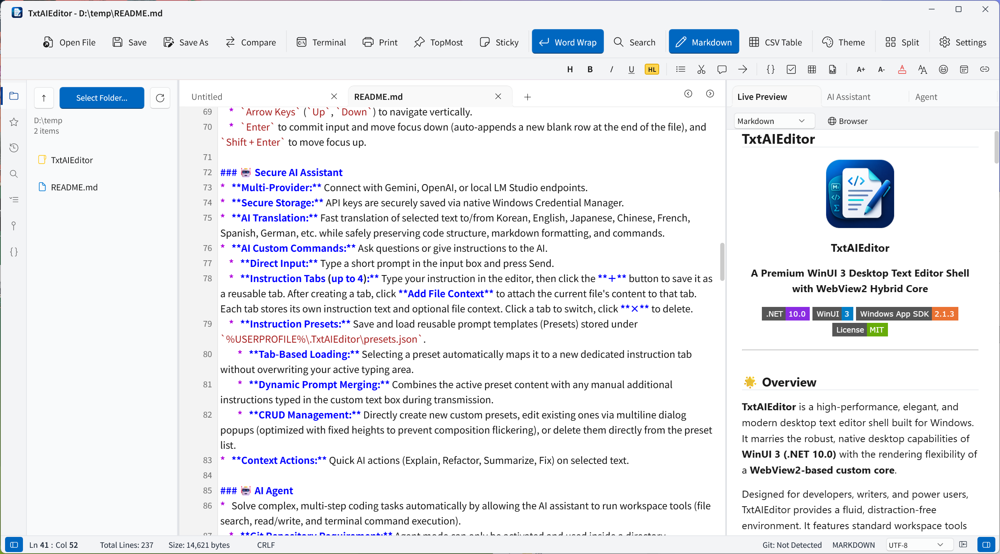

# TxtAIEditor

<p align="center">
  
</p>

<h3 align="center">TxtAIEditor</h3>

<p align="center">
  <strong>A Premium WinUI 3 Desktop Text Editor Shell with WebView2 Hybrid Core</strong>
</p>

<p align="center">
  <a href="https://dotnet.microsoft.com/download/dotnet/10.0"></a>
  <a href="https://learn.microsoft.com/en-us/windows/apps/winui/winui3/"></a>
  <a href="https://github.com/microsoft/WindowsAppSDK"></a>
  <a href="LICENSE"></a>
</p>

---

## 🌟 Overview

**TxtAIEditor** is a high-performance, elegant, and modern desktop text editor shell built for Windows. It marries the robust, native desktop capabilities of **WinUI 3 (.NET 10.0)** with the rendering flexibility of a **WebView2-based custom core**. 

Designed for developers, writers, and power users, TxtAIEditor provides a fluid, distraction-free environment. It features standard workspace tools like a **live Markdown/HTML/LaTeX previewer**, a **built-in terminal**, **comprehensive Git integration**, **multi-provider AI assistance and AI agent**, and a **virtualized editor core** capable of opening and editing files from small snippets to 200MB+ texts seamlessly.

<p align="center">
  
</p>

---

## ✨ Key Features

### 📝 Virtualized Editor Core
*   **Massive File Support:** Instantly open and edit extremely large files (200MB+ texts) with zero lag, keeping the editor highly responsive.
*   **Virtual Scrolling:** Renders only visible viewport lines plus an overscan buffer, keeping DOM elements minimal and rendering fast.
*   **Syntax Highlighting:** Premium, high-performance syntax coloring for Markdown (headers, lists, blockquotes, bold/italic, code blocks, links), C#, JavaScript, Python, HTML, CSS, LaTeX, and many more.
*   **Auto-Completion & Snippets:** Intelligent auto-completion suggesting variables, keywords, and customizable snippets (such as Markdown tables, LaTeX matrices, HTML5 shells, C# notifier properties) that insert seamlessly via Enter or Tab.
*   **Rich Markdown Toolbar:** Quick-apply styling (bold, italic, underline, list, color, tables) to selected text.

### 💾 Auto-Save
*   **Smart Background Auto-Save:** Automatically saves modified files within the active Git repository folder every 5 seconds.
*   **Workspace-Aware:** By default, only triggers when a Git repository folder is opened in the editor.
*   **Optional Non-Git Folders:** The Editor settings include an opt-in checkbox to allow Autosave in folders that are not Git repositories.

### 🔐 Encrypted Notes
*   **Secure Note Compatibility:** Opens and saves `SECURE_NOTE_V1` encrypted note files compatible with the Simple Memo encryption format.
*   **Password Prompt on Open:** Encrypted files ask for a password before the decrypted text is loaded into the editor.
*   **Encrypted Save Preservation:** Saving an encrypted tab writes the file back in encrypted form instead of leaking plain text to disk.
*   **Tab Lock Indicator:** Encrypted tabs show a lock icon at the front of the tab.
*   **Password Management:** Right-click the tab or lock icon to encrypt a plain tab, change the password, or remove encryption. Password changes and removal require matching double-entry confirmation.

### 🖥️ Native Premium Windows UI
*   **Mica Backdrop & Dark Mode:** Native Windows themes using a high-fidelity Mica backdrop.
*   **Multi-Pane Splitters:** Easily adjust sidebars, preview sections, and terminal panes via interactive C# split-controls.
*   **Always on Top & Sticky Notes:** Pin your editor window or transform to sticky notes directly from the toolbar.

### 👁️ Real-Time Preview
*   **Live Renderer:** View Markdown, HTML, Aozora or LaTeX (powered by KaTeX) in a split view or an external browser.
*   **Inline Live Preview:** Renders Markdown elements (headers, lists, tables, code blocks, images) directly within the editor area. Non-active lines transition into their styled preview form, and automatically revert to raw source text when focused or edited for a seamless WYSIWYG-like experience.

### 📄 Office Document Viewer
*   **Document Preview:** Preview PDF, DOCX, PPTX, HWPX, and XLSX files directly inside TxtAIEditor without leaving the workspace.
*   **Unified Viewer Workflow:** Open supported office documents from the Explorer or editor tabs and inspect their contents alongside the rest of your project files.

### 📊 Interactive CSV Table Mode
*   **Grid Editor Shell:** Automatically renders `.csv` files into a premium, highly responsive interactive spreadsheet-like grid instead of raw comma-separated text.
*   **Column & Row Multi-Select:** Click row numbers or column headers to select entire rows/columns, with support for range dragging and multi-selection using `Ctrl` and `Shift` keys.
*   **Formula Bar & Name Box:** Built-in toolbar at the top showing the current active cell coordinates (e.g., `A1`, `D12`) along with an editable formula bar for writing and viewing values.
*   **Dynamic Column Resizing:** Drag the border of any column header to resize column widths in real-time.
*   **Native Spreadsheet Navigation:** Use standard hotkeys to navigate the grid:
    *   `Tab` / `Shift + Tab` to move focus horizontally.
    *   `Arrow Keys` (`Up`, `Down`) to navigate vertically.
    *   `Enter` to commit input and move focus down (auto-appends a new blank row at the end of the file), and `Shift + Enter` to move focus up.

### 🤖 AI Assistant
*   **Multi-Provider:** Connect with Gemini, OpenAI, OpenRouter, OpenCode Go/Zen, Ollama/Ollama Cloud or local LM Studio endpoints.
*   **Secure Storage:** API keys are securely saved via native Windows Credential Manager.
*   **AI Translation:** Fast translation of selected text to/from Korean, English, Japanese, Chinese, French, Spanish, German, etc. while safely preserving code structure, markdown formatting, and commands. *(When translating with file context, it automatically performs chunk processing).*
*   **Context Actions:** Quick AI actions (Explain, Refactor, Summarize, Fix) on selected text. *(When summarizing with file context, it automatically performs chunk processing to handle large documents).*
*   **AI Custom Commands:** Ask questions or give instructions to the AI.
    *   **Direct Input:** Type a short prompt in the input box and press Send.
    *   **Instruction Presets:** Save instructions as custom prompt presets for quick access.

### 🤖 AI Agent
*   **Autonomous Problem Solving:** Solve complex, multi-step editing tasks automatically by allowing the AI agent to run workspace tools (file search, read/write, terminal command execution, and web search/retrieval).
    *   **Web Search & Fetch:** Supports real-time web search and webpage content extraction powered by the Exa API or Exa MCP server, allowing the agent to find live documentation, code samples, and up-to-date information. (Configurable via Exa API Key and Endpoint in the settings).   
    *   **Document Extraction:** The agent can convert PDF, DOCX, PPTX, XLSX, and HWPX files into readable workspace files via `extract_document`. PDF/DOCX/PPTX/HWPX are saved as `.txt`, XLSX is exported as CSV, and multi-sheet XLSX files are split into `_sheet1.csv`, `_sheet2.csv`, etc. The agent records only the source and generated file paths, then reads targeted ranges from the converted files to avoid overflowing model context.
*   **Persona & System Instructions:** You can specify custom personas and system instructions for the AI agent.
*   **Custom Agent Skills:** Extend the agent's capabilities by installing custom skills into the skills directory.
    *   **Skill Creator:** To create a new skill, open the skill list, check and enable `skill-creator`, then ask the agent to create a skill for a specific task. The agent will generate the skill and it will be registered automatically in the skill list.
    *   **Skill Directories:** The agent loads built-in skills from the app's `md\skills\` directory, user skills from `%USERPROFILE%\.TxtAIEditor\skills\`, and legacy user skills from `%USERPROFILE%\.agents\skills\`.
    *   **Default User Skill Directory:** New TxtAIEditor skills should be saved under `%USERPROFILE%\.TxtAIEditor\skills\`.
    *   **Skill Structure:** Skills can be structured in two ways:
        *   **Folder-based Skills:** A subfolder under a skills directory (for example, `%USERPROFILE%\.TxtAIEditor\skills\<SkillName>\`) containing a `SKILL.md` file. The folder name is used as the skill name.
        *   **File-based Skills:** A single `.md` file directly under a skills directory (for example, `%USERPROFILE%\.TxtAIEditor\skills\MySkill.md`). The file name (without extension) is used as the skill name.
    *   **Description Parsing:** The skill description shown in the user interface is extracted from:
        *   YAML frontmatter (e.g., `description: ...` or `Description: ...`) at the top of the file.
        *   A Markdown heading named `# Description`.
        *   The first non-empty paragraph of the file.
 *   **Recommended Installation:** For the best performance and compatibility, it is highly recommended to install:
     *   [PowerShell 7](https://learn.microsoft.com/en-us/powershell/scripting/install/installing-powershell-on-windows) (`pwsh`)
     *   [ripgrep](https://github.com/BurntSushi/ripgrep) (`rg`) for plain text and source code search.
     *   [ripgrep-all](https://github.com/phiresky/ripgrep-all) (`rga`) for searching supported document formats (PDF, DOCX, etc.). Use `extract_document` for HWPX.
     *   [pdftotext](https://poppler.freedesktop.org/) (Xpdf/Poppler tools) for fast PDF conversion inside `extract_document`.

### 💻 Terminal
*   **Shell Profiles:** Launch PowerShell, Command Prompt, Git Bash, or WSL sessions directly beneath your editor canvas.
*   **Path Syncing:** Automatically matches the terminal's working directory with the active workspace.
*   **VS Code-style Interaction:** Right-click to paste, right-click a selection to copy, and Ctrl+click terminal paths to open them.

### 🌿 Git Panel
*   **Status Tracker:** View staged/unstaged changes, stage/unstage files, execute commits, and push to remotes.
*   **History Viewer:** Visual repository branch and commit history logs.

### ⭐ Favorites
*   **File & Folder Bookmarks:** Pin any file or folder to your Favorites panel for instant one-click access — no more digging through deep directory trees.
*   **Right-Click to Add:** Simply **right-click** any file or folder in the Explorer panel and select **"Add to Favorites"** from the context menu.

### 📑 Table of Contents (TOC) & Document Outline
*   **Smart Outline Generator:** Automatically parses and generates a structural document outline based on the active file:
    *   **Markdown:** Maps H1 through H6 headings (`#` to `######`) to hierarchical tree levels.
    *   **Aozora Bunko:** Supports Japanese Aozora text files, parsing block/inline/wrapped headings while cleaning ruby markup (`《...》`, `｜`) and tags for a distraction-free overview.
    *   **Code Outline:** Builds structural trees of classes, methods, structs, or functions for major languages including **C#**, **Python**, **JavaScript/TypeScript**, and **Go** (with a general signature fallback for others).
*   **Interactive Jump:** Double-clicking any outline item instantly scrolls the viewport to focus the target line.

### 🌐 Multilingual Support
* Native support for English (`en-US`), Korean (`ko-KR`), and Japanese (`ja-JP`). The user interface automatically adapts to your system language or preferred settings for a fully localized desktop experience.

## ⌨️ Keyboard Shortcuts & Special Features

TxtAIEditor is designed for speed and productivity, packing standard IDE shortcuts and premium interactive elements.

### 🔌 Keyboard Shortcuts

| Shortcut | Description |
| :--- | :--- |
| `Ctrl + N` | New Tab |
| `Ctrl + S` | Save File |
| `Ctrl + Shift + S` | Save As |
| `Ctrl + O` | Open File |
| `Ctrl + F` | Find / Search |
| `Ctrl + W` | Close Tab |
| `Ctrl + P` | Print |
| `Ctrl + 1` | Toggle Left Panel |
| `Ctrl + 2` | Toggle Right Panel |
| `Ctrl + 3` | Expand Right Panel |
| `` Ctrl + ` `` | Toggle Terminal |
| `Ctrl + Z` | Undo |
| `Ctrl + Y` | Redo |
| `Ctrl + C` | Copy |
| `Ctrl + V` | Paste |
| `Ctrl + X` | Cut |
| `Ctrl + Mouse Wheel` | Zoom In / Out |
| `Ctrl + Enter` | Send AI Prompt |
| `F4` | Toggle Live Preview |
| `F9` | Toggle Always on Top |
| `F10` | Toggle Theme (Dark / Light) |
| `F11` | Toggle Maximize Window |
| `F12` | Toggle Sticky Note Mode |

### 🖱️ Column Selection (Multi-Cursor Selection)

*   **Column Drag Selection:**
    *   Hold **`Alt` + Mouse Drag** (or **`Shift + Alt` + Mouse Drag**) to select text in a vertical block or column.
    *   This places cursors on multiple consecutive lines, enabling you to edit, write, or delete text across multiple rows simultaneously.

### 🛠️ Interactive Tool Buttons

*   **Custom Text Color Selector:**
    *   **Right-Click** on the `TextColor` button to summon the native **Color Picker** dialog, allowing you to select and configure custom text colors precisely.
*   **AI Translation Target Language Selector:**
    *   **Right-Click** on the translate button to open a context menu enabling you to switch target translation languages (Korean, English, Japanese, Chinese, French, Spanish, German) instantly.
*   **Add to Favorites:**
    *   **Right-Click** any file or folder in the Explorer panel and choose **"Add to Favorites"** to instantly pin it to your Favorites sidebar for quick access.

## 🚀 Getting Started

### 📥 Download
You can download the latest installer (built using **Inno Setup**) from the [Releases Page](https://github.com/kirinonakar/TxtAIEditor/releases).

- [Microsoft Store](https://apps.microsoft.com/detail/9NTZR1TNHXR7?hl=ko-kr&gl=KR&ocid=pdpshare)

### Manual build Prerequisites

To build and run TxtAIEditor locally, make sure you have:
*   **Windows 10 / 11**
*   **Visual Studio 2022** (v17.10 or later recommended)
*   **.NET 10.0 SDK**
*   **Windows App SDK** component installed inside Visual Studio.
*   **WebView2 Runtime** (installed by default on modern Windows).

### How to Run

1.  **Clone the Repository:**
    ```bash
    git clone https://github.com/kirinonakar/TxtAIEditor.git
    cd TxtAIEditor
    ```
2.  **Open the Solution:**
    Open the `TxtAIEditor.slnx` (or `TxtAIEditor.csproj`) inside Visual Studio.
3.  **Restore & Build:**
    Visual Studio will automatically restore NuGet packages (such as `Microsoft.WindowsAppSDK`).
4.  **Run:**
    Set the startup project to `TxtAIEditor` and press `F5` to build and run in unpackaged mode.

---

## 📄 License

This project is licensed under the MIT License - see the [LICENSE](LICENSE) file for details.

Copyright (c) 2026 **kirinonakar**. All rights reserved.

### Third-Party Licenses

This software includes Mermaid, xterm.js, and KaTeX.

**Mermaid**  
License: MIT License  
Copyright (c) 2014 - 2022 Knut Sveidqvist  

**xterm.js**  
License: MIT License  
Copyright (c) 2017-2019, The xterm.js authors  
Copyright (c) 2014-2016, SourceLair Private Company  
Copyright (c) 2012-2013, Christopher Jeffrey  

**KaTeX**  
License: MIT License  
Copyright (c) 2013-2020 Khan Academy and other contributors  

The MIT license text below applies to the third-party components listed above.

The MIT License (MIT)

Permission is hereby granted, free of charge, to any person obtaining a copy
of this software and associated documentation files (the "Software"), to deal
in the Software without restriction, including without limitation the rights
to use, copy, modify, merge, publish, distribute, sublicense, and/or sell
copies of the Software, and to permit persons to whom the Software is
furnished to do so, subject to the following conditions:

The above copyright notice and this permission notice shall be included in all
copies or substantial portions of the Software.

THE SOFTWARE IS PROVIDED "AS IS", WITHOUT WARRANTY OF ANY KIND, EXPRESS OR
IMPLIED, INCLUDING BUT NOT LIMITED TO THE WARRANTIES OF MERCHANTABILITY,
FITNESS FOR A PARTICULAR PURPOSE AND NONINFRINGEMENT. IN NO EVENT SHALL THE
AUTHORS OR COPYRIGHT HOLDERS BE LIABLE FOR ANY CLAIM, DAMAGES OR OTHER
LIABILITY, WHETHER IN AN ACTION OF CONTRACT, TORT OR OTHERWISE, ARISING FROM,
OUT OF OR IN CONNECTION WITH THE SOFTWARE OR THE USE OR OTHER DEALINGS IN THE
SOFTWARE.
